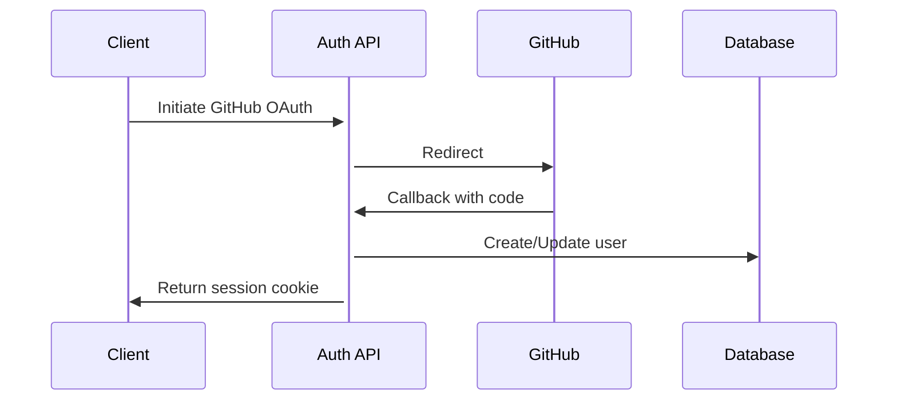

# EtoDev Hub Technical PRD

## 1. Architectural Overview
 *[Placeholder for diagram]*

### Tech Stack:
- **Frontend**: Next.js 14 (App Router), TypeScript, shadcn/ui
- **Auth**: NextAuth.js (GitHub + Email)
- **Database**: PostgreSQL (Prisma ORM)
- **State Management**: React Context + SWR
- **Markdown**: react-markdown
- **Hosting**: Vercel

## 2. Enhanced File Structure Specification

```
/
├── app/
│   ├── (auth)/                      # Auth route group
│   │   └── login/
│   │       └── page.tsx             # Client component
│   ├── add-project/
│   │   └── page.tsx                 # Server component
│   ├── projects/
│   │   ├── [id]/
│   │   │   └── page.tsx             # Dynamic route (server)
│   │   └── page.tsx                 # Project list (server)
│   ├── api/                         # API routes
│   │   ├── auth/
│   │   │   └── [...nextauth]/
│   │   │       └── route.ts         # NextAuth config
│   │   ├── projects/
│   │   │   └── route.ts             # GET/POST projects
│   │   └── ...                     # Other endpoints
│   └── layout.tsx                   # Root layout
├── components/
│   ├── project/
│   │   ├── project-card.tsx         # Client component
│   │   └── project-form.tsx         # Client+Server
│   ├── comments/
│   │   └── comment-section.tsx      # Client component
│   └── ui/                          # shadcn components
├── lib/
│   ├── db.ts                        # Prisma client
│   ├── types.ts                     # TS interfaces
│   └── actions/                     # Server actions
├── public/
│   └── assets/                      # Static files
└── .env.example                     # Env template
```

## 3. Core Functionality Technical Specs

### 3.1 Project Showcase
**Data Flow:**
1. Server Component (`app/projects/page.tsx`) fetches via Prisma
2. Passes data to `<ProjectGrid>` (server)
3. `<ProjectGrid>` renders `<ProjectCard>` (client)

**API Example:**
```typescript
// GET /api/projects
Response: {
  projects: {
    id: string
    title: string
    upvotes: number
    techStack: string[]
    // ...other fields
  }[]
}
```

### 3.2 Voting System
**Client-Server Contract:**
```typescript
// POST /api/vote
Request: {
  projectId: string
  userId: string
  type: 'up' | 'down'
}

Response: {
  newScore: number
  userVote: 'up' | 'down' | null
}
```

### 3.3 Authentication Flow


## 4. Development Standards

### 4.1 Data Handling
```typescript
// Example Prisma schema
model Project {
  id        String   @id @default(uuid())
  title     String
  techStack String[]
  upvotes   Int      @default(0)
  userId    String
  user      User     @relation(fields: [userId], references: [id])
}

// Example TypeScript interface
interface ProjectCardProps {
  id: string
  title: string
  description: string
  techStack: string[]
  upvotes: number
}
```

### 4.2 Error Handling Strategy
**Server Errors:**
```typescript
// API route error template
export async function GET() {
  try {
    // ...logic
  } catch (error) {
    console.error('[PROJECTS_GET]', error)
    return NextResponse.json(
      { error: "Failed to fetch projects" },
      { status: 500 }
    )
  }
}
```

**Client Handling:**
```jsx
// Example error boundary
'use client'
export default function ErrorFallback({ error }) {
  return (
    <div className="alert alert-error">
      <span>Error: {error.message}</span>
    </div>
  )
}
```

## 5. Documentation Standards

### 5.1 API Documentation Template
**Endpoint:** `/api/projects`  
**Method:** GET  
**Query Params:**
- `sort` (optional): "recent" | "top" | "commented"
- `tech` (optional): string[]  

**Success Response:**
```json
{
  "data": [Project],
  "pagination": {
    "total": 100,
    "page": 1,
    "pageSize": 10
  }
}
```

### 5.2 Component Documentation
**`<ProjectCard>` Component**
```markdown
## Props:
- `project` (Required): Project object
- `showVoting` (Optional): boolean
- `onVote` (Optional): (type: 'up'|'down') => void

## Usage:
```jsx
<ProjectCard 
  project={projectData}
  showVoting={true}
/>
```

## 6. Quality Requirements

1. **Performance:**
   - Largest Contentful Paint < 1.5s
   - Server responses < 300ms (95th percentile)

2. **Security:**
   - All API routes protected by CORS
   - Rate limiting on auth endpoints
   - SQL injection protection via Prisma

3. **Accessibility:**
   - WCAG AA compliance
   - Screen reader support for voting system
   - Keyboard navigation for project cards

## 7. Deployment Checklist

1. **Required Environment Variables:**
```env
DATABASE_URL=postgres://...
GITHUB_CLIENT_ID=...
GITHUB_CLIENT_SECRET=...
NEXTAUTH_SECRET=...
```

2. **Build Process:**
```bash
# Local setup
npx prisma generate
npx prisma migrate dev

# Production build
npm run build
```
